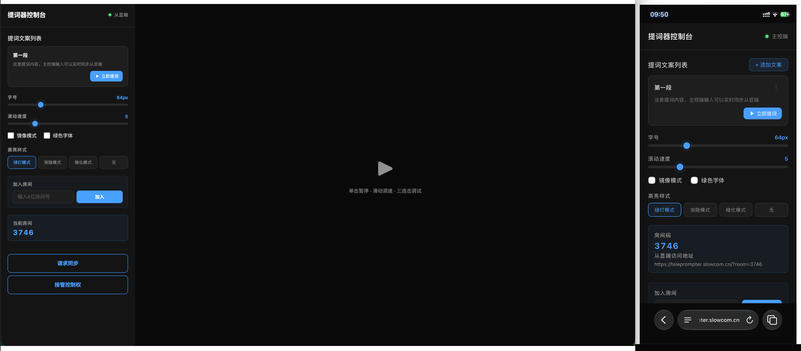

# Teleprompter - Web 提词器

Vue 3 Web 提词器，支持滚动同步高亮、房间码多设备配对、Docker 部署。

## 主控端和从显端


主控端一般是电脑或者手机，方便直接粘贴或者输入提词文本。从显端一般是手机或者大屏幕显示设备，支持自动同步文本以及提词显示。

## 功能

### 可以解决什么问题？
- 大部分提词器APP都无法实现文案同步，如果用iPad提词，需要将文案从电脑上复制到iPad，苹果电脑还可以通过隔空投送一个word文档，但如果是Windows电脑，则需要借助微信或者其他方式同步文档。相当麻烦
- 目前提词器APP好用的要钱或有广告，本项目完全开源，无广告

### 核心

| 功能    | 说明                                    |
|-------|---------------------------------------|
| ⭐文案同步 | 主控端编辑提词内容，从显端自动同步显示，支持多段文案            |
| 提词滚动  | 输入文本，调节字号（16–200px）和滚动速度（1–20），自动平滑滚动 |
| 滚动同步高亮 | 文字滚动到哪高亮到哪，已读变色、当前字高亮                 |
| 手动调速  | 鼠标拖拽或触屏滑动实时调速，松手后自动滚动从新位置继续           |
| 3 秒倒计时 | 开始提词前 3→2→1 倒计时（60vh 大字号）             |

### 显示

| 功能 | 说明 |
|------|------|
| 镜像模式 | 水平翻转，适配提词器反射镜 |
| 绿色字体 | 高对比度绿色文字 |
| 高亮样式 | 4 选 1：绿灯模式 / 渐隐模式 / 暗化模式 / 无 |

### 同步

| 功能 | 说明                                   |
|------|--------------------------------------|
| 房间码配对 | 主控端自动生成 6 位房间码，从显端通过通过输入主控端房间号加入同一房间 |
| 数据隔离 | 不同房间码互不干扰，多人同时使用不串数据                 |
| 跨设备同步 | 自动同步文本、字号、速度、播放状态                    |
| 主从角色 | 房间内首连设备为主控，后续为从显；支持接管控制权             |

### 响应式

| 设备 | 布局 |
|------|------|
| 桌面（≥1024px） | 左侧控制面板 380px + 右侧全屏提词 |
| 平板（768–1023px） | 上下分栏，控制面板可折叠 |
| 手机（<768px） | 编辑时全屏控制面板，提词时全屏显示 + 底部控制按钮 |
| 手机横屏 | 开始提词自动请求全屏 |

## 技术栈

| 层 | 技术                               |
|---|----------------------------------|
| 前端 | Vue 3 (Composition API) + Vite 5 |
| 后端 | Node.js + WebSocket（ws 库）        |
| 容器化 | Docker（多阶段构建）                    |
| 部署 | Docker + Caddy 反代          |

## 项目结构

```
teleprompter/
├── index.html
├── package.json
├── vite.config.js
├── Dockerfile                          # Docker 多阶段构建
├── server.js                           # HTTP 静态服务 + WebSocket 房间管理
├── src/
│   ├── main.js
│   ├── App.vue                         # 根组件：双模式切换 + 状态管理
│   ├── components/
│   │   ├── ControlPanel.vue            # 控制面板：文本/字号/速度/样式 + 房间码
│   │   └── TeleprompterDisplay.vue     # 提词显示：滚动 + 高亮 + 倒计时
│   └── composables/
│       ├── useWebSocket.js             # WebSocket + 房间码 + 主从角色
│       └── useSpeechRecognition.js     # 语音识别（备用，当前未启用）
```

## 快速开始

```bash
npm install
npm run dev        # 开发模式（Vite 5173 + WebSocket 3000）
```

```bash
npm run build      # 构建
node server.js     # 生产模式（单端口 3000：静态 + WebSocket）
```

## Docker 部署

```bash
# 构建镜像
docker build -t teleprompter .

# 启动容器
docker run -d -p 3000:3000 --restart always --name teleprompter teleprompter
```

### 配置反向代理（HTTPS + 域名）

#### Nginx

```nginx
server {
    listen 443 ssl;
    server_name your-domain.com;
    ssl_certificate     /path/to/fullchain.pem;
    ssl_certificate_key /path/to/privkey.pem;

    location / {
        proxy_pass http://127.0.0.1:3000;
        proxy_http_version 1.1;
        proxy_set_header Upgrade $http_upgrade;
        proxy_set_header Connection "upgrade";
        proxy_set_header Host $host;
        proxy_set_header X-Real-IP $remote_addr;
    }
}
```

#### Caddy 2

```caddy
your-domain.com {
    reverse_proxy container-name:3000
    tls your-email@example.com
}
```

> Caddy 2 自动处理 Let's Encrypt 证书和 WebSocket 升级，无需额外配置。

### 部署流程

```bash
# 上传项目到服务器
scp -r . root@<服务器IP>:/opt/teleprompter

# 服务器上执行
ssh root@<服务器IP>
cd /opt/teleprompter
docker build -t teleprompter .
docker run -d -p 3000:3000 --restart always --name teleprompter teleprompter

# 配置 Caddy / Nginx 反代并 reload
```

## 多设备同步

### 房间码机制

主控端打开页面后自动生成 6 位房间码（如 `K7XM3R`），控制面板显示从显端完整访问地址。

| 设备 | 访问 | 角色 |
|------|------|------|
| 电脑 | `https://your-domain.com` | 自动生成房间码 → 主控 |
| iPad | `https://your-domain.com?room=K7XM3R` | 加入房间 → 从显 |
| 另一台电脑 | `https://your-domain.com` | 自动生成新房间码 → 互不干扰 |

### 数据流

```
主控端 (房间 K7XM3R)
  │ 编辑文本 / 调字号 / 调速度 / 开始提词
  ▼
server.js WebSocket (房间隔离)
  │ sync / play 消息
  ▼
从显端 (房间 K7XM3R)
  │ 自动同步文本 / 字号 / 速度 / 播放状态
```

## 操作说明

### 控制面板

| 控件 | 说明 |
|------|------|
| 文本框 | 输入或粘贴提词文本（主控端可编辑，从显端只读） |
| 字号滑块 | 16–200px，默认 64px |
| 速度滑块 | 1–20，控制滚动速度 |
| 镜像模式 | 开启后文字水平翻转 |
| 绿色字体 | 切换高对比度绿色 |
| 高亮样式 | 绿灯 / 渐隐 / 暗化 / 无 |
| 房间码 | 主控连上后显示 6 位码 + 从显完整访问 URL |
| 开始提词 | 进入提词模式 + 3 秒倒计时 |

### 提词模式

| 操作 | 行为 |
|------|------|
| 单击文字 | 无操作 |
| 三连击 | 打开/关闭调试面板（滚动进度 + 已读字数） |
| 鼠标拖拽 | 手动调整滚动位置，松手后恢复自动滚动 |
| 触屏滑动 | 文字跟随手指，松手后恢复自动滚动 |
| 鼠标滚轮 | 调整位置，200ms 后恢复自动滚动 |
| ▶ 暂停/播放 | 切换自动滚动 |
| ■ 停止 | 退出提词，返回编辑模式 |

## License

MIT
